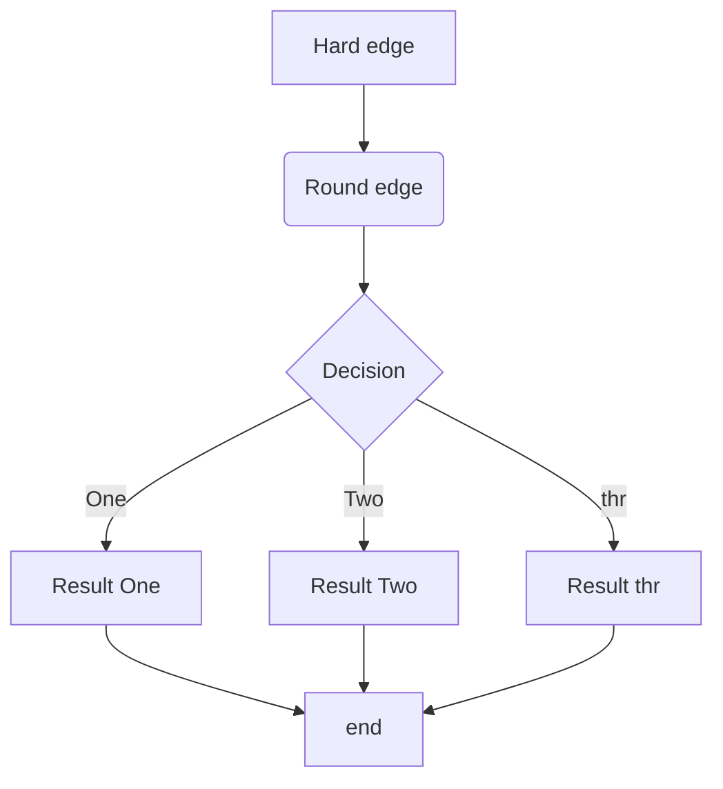

<head>
    <script src="https://cdn.mathjax.org/mathjax/latest/MathJax.js?config=TeX-AMS-MML_HTMLorMML" type="text/javascript"></script>
    <script type="text/x-mathjax-config">
        MathJax.Hub.Config({
            tex2jax: {
            skipTags: ['script', 'noscript', 'style', 'textarea', 'pre'],
            inlineMath: [['$','$']]
            }
        });
    </script>
</head>

[TOC]

simple，yet powerful

支持实时预览的markdown编辑及查看工具

## markdown是什么

简单的说，它是一门标记语言。类似`html`，但是语法更简单，更容易实现。

如很多爱好者所说：

> `markdown`让人专注于文字本身，而不是排版。

上手容易，比word轻量太多。可以直接转为html和pdf，可移植性强，通过渲染可以实现非常好看的页面效果。

换个说法，一切皆代码。图片？可以通过`！[](图片路径)`来插入。公式？把公式的latex放在`$$`符里就完事了。流程图？用代码写。表格？用代码画。代码放到文档里还想高亮？`~~~`帮你解决。超链接？`[显示文字](链接地址)`搞定。多级标题？一级一个`#`，二级两个`##`，三级三个，四级四个。。。七级？

还有就是很多博客系统都是支持md的，你用博客或者做一个自己的博客（`hexo`、`mkdocs`等），用md都是非常方便的。

用md的话有一款好用的编辑器事半功倍，这个typora就是一个被很多人安利的编辑器。

## 插入图片

可以通过代码`！[](图片路径)`插入图片，也可以直接复制上，在typora中粘贴。（拖进来也可以）

设置一下设置图片插入到指定路径。


复制图片后再Typora中直接粘贴即可。

可以在文件夹中看到，已复制入本文件夹内。


把优先使用相对路径勾选上。可以看到再粘贴图片后文件路径为相对路径。

## 数学公式

对于latex语法支持非常完善，内置渲染引擎完美。

```markdown
$$
\mathbf{V}_1 \times \mathbf{V}_2 =  \begin{vmatrix}
\mathbf{i} & \mathbf{j} & \mathbf{k} \\
\frac{\partial X}{\partial u} &  \frac{\partial Y}{\partial u} & 0 \\
\frac{\partial X}{\partial v} &  \frac{\partial Y}{\partial v} & 0 \\
\end{vmatrix}
$$
```

$$
\mathbf{V}_1 \times \mathbf{V}_2 =  \begin{vmatrix}
\mathbf{i} & \mathbf{j} & \mathbf{k} \\
\frac{\partial X}{\partial u} &  \frac{\partial Y}{\partial u} & 0 \\
\frac{\partial X}{\partial v} &  \frac{\partial Y}{\partial v} & 0 \\
\end{vmatrix}
$$

还可以复制mathtype中的公式在typora中粘贴。可以不用自己敲。。。

也可以放置段内公式，用两个\$符号围起来就可以了。$\frac{\alpha} \beta  \times \gamma$

## 代码高亮

行内代码\``括起，代码块

\``` 语言名

代码内容

\```

即可实现相应语言的代码高亮显示。

或者直接<kbd>Ctrl</kbd>+<kbd>Shift</kbd>+<kbd>K</kbd>出现代码输入框，在输入完代码后下下方框内选择语言。


## 流程图

可以直接在markdown中生成流程图！语法简洁易懂。

### sequence图

敲入以下代码，选择语言为`sequence`则可生成如下图

```markdown
李雷 -> 韩梅梅 : hello how are you? 
韩梅梅 -> 李刚: hello how are you? 
Note right of 韩梅梅: 韩梅梅心想  
韩梅梅 --> 李雷: I'm fine，thanks and you?
Note left of 韩梅梅: 韩梅梅心想  
韩梅梅 -> 李雷: I'm fine，thanks and you2?
李刚 --> 李雷: I'm fine，thanks and you3?
```

```sequence
李雷 -> 韩梅梅 : hello how are you? 
韩梅梅 -> 李刚: hello how are you? 
Note right of 韩梅梅: 韩梅梅心想  
韩梅梅 --> 李雷: I'm fine，thanks and you?
Note left of 李雷: 李雷心想  
韩梅梅 -> 李雷: I'm fine，thanks and you2?
李刚 --> 李雷: I'm fine，thanks and you3?
```

### flowchart图

使用以下代码，语法选择flow，具体语法规则参考，Flowchart.js

```markdown
st=>start: 闹钟响起
op=>operation: 与床板分离
cond=>condition: 分离成功？
e=>end: 快乐的一天

st->op->cond
cond(yes)->e
cond(no)->op
```


```flow
st=>start: 闹钟响起
op=>operation: 与床板分离
cond=>condition: 分离成功？
e=>end: 快乐的一天

st->op->cond
cond(yes)->e
cond(no)->op
```

### mermaid图

使用以下代码，语法选择mermaid，具体语法规则参考mermaid.md

```
graph TD
A[Hard edge] -->B(Round edge)
B -->C{Decision}
C -->|One| D[Result One]
C -->|Two| E[Result Two]
C -->|thr| F[Result thr]
D-->G[end]
E-->G[end]
F-->G[end]
```



## 大纲视图

自动将heading作为文章大纲，并且按照标题级别进行树状归纳。文章长了的时候非常方便，只要点击大纲中的标题就可以跳转。


## 快捷键

记住常用快捷键写作效率翻倍。

| 快捷键       | 功能                   |
| ------------ | ---------------------- |
| <kbd>Ctrl</kbd>+<kbd>/</kbd> | 切换源码模式与显示模式 |
| <kbd>Ctrl</kbd>+<kbd>Shift</kbd>+<kbd>K</kbd> | 插入代码块             |
| <kbd>Ctrl</kbd>+<kbd>T</kbd> | 插入图片               |
| <kbd>Ctrl</kbd>+<kbd>1</kbd>~<kbd>6</kbd> | 文本变为各级标题       |
| <kbd>Ctrl</kbd>+<kbd>K</kbd> | 插入超链接             |
| <kbd>Ctrl</kbd>+<kbd>0</kbd> | 文本变为段落格式       |

更多详见快捷键

```C
void fun（）	
```

111

## 各种格式导出

支持pdf、html、png等各种各样格式的导出。

word、Epub、rtf等等需要`pandoc`的支持。

## 字数统计功能

右下角，可以看到你写了多少字。

## 打字机模式，专注模式

打字机模式使得你所编辑的那一行永远在屏幕正中。

专注模式使你正在编辑的那一行保留颜色，其他的字体呈灰色。

## emoji表情

`:emoji:`打出emoji，且软件会给出图形提示。


:copyright::atom_symbol::heart::coffee:

## Html标签

支持许多采用的html标签。

\<kbd>F1</kbd> <kbd>F1</kbd> 

\<span style = 'color:red;background:yellow;font-size:2rem;color:red'>helloworld</span>

<span style = 'color:red;background:yellow;font-size:2rem;color:red'>helloworld</span>

\&reg;  &reg;

\&#14;  &#14;

