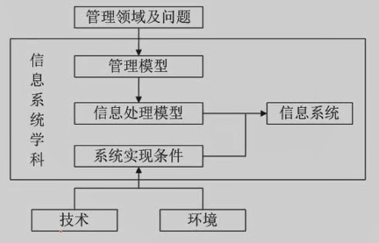
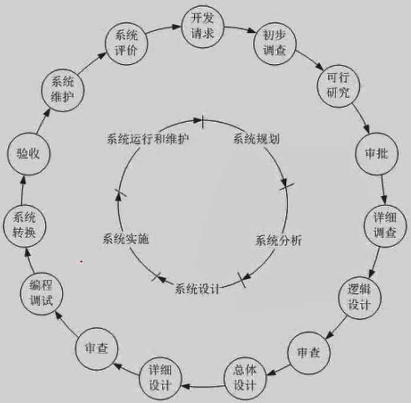

<head>
    
    
</head>

# 内容提要

信息系统工程总体规划 

政府信息化与电子政务 

企业信息化与电子商务 

信息资源管理

信息化的标准、法律和规定

# 信息系统工程总体规划 

## **信息**

不确定性的减少，系统有序程度的度量（信息论创始人**香农**给出）

### 信息单位：1bit

热力学中的熵引入信息论，系统无序程度的度量，所有信息表现为负熵。
$$
H(x) = -\sum P(x_i)\log_2P(x_i)
$$
其中，$x_i$表示第i种状态，$P(x_i)$表示第i种状态发生的概率。

### 特性

客观性（主观信息（决策、计划--》需要转为客观信息，行动），客观信息（国际形势，客观存在）） 

普遍性 无限性 动态性 依附性 变换性 

传递性 层次性 系统性 转化性 及时性 安全性

**理解每种特性背后的含义，不用背下来**

金融--安全性

不同行业，每个系统侧重面不一样，根据实际情况确定系统最关注的的哪一个侧面。

## 信息系统

系统是指由多个元素有机地结合在一起，执行特定的功能以达到特定目标的集合体 

信息系统是输入数据，通过加工处理，产生信息的系统（输入的是数据，输出的是信息，信息是加工处理以后的数据，数据是信息生成所需要的材料，信息的存在形式和形参）

问题来源：企业管理（商学院）面向管理是信息系统的一个显著特点。

管理模型：系统服务对象领域方面的知识。分析和处理的模型。

信息处理模型：信息获取、存储、传输、加工和使用的一些规则。

系统实现条件：可供使用的计算机技术和通信技术，以及可供使用的人员和资源的控制和融合。

## 信息系统工程

将信息系统的建设以系统工程的方式来实现。用系统工程的原理和方法来指导信息系统建设的工程技术学科。是系统工程学科的分支。同时具有本身的显著特征。我们关注的是整个信息系统建设的**生命周期**。如下图。

产生、成熟、消亡的整个过程，生命周期。

### 系统规划

开发请求->审批通过，作用：指明信息系统在企业经营战略中的作用，指导信息系统的开发，应当包括开发目标、总体架构、组织结构、管理流程、实施计划、技术规范等等。 

### 系统分析

详细调查->通过审查，为系统的设计阶段提供逻辑模型。

主要任务：可行性分析和总体规划的基础上，对现有系统进一步的详细调查。并且整理出规范的文档资料，对企业的组织结构、业务流程和经营管理进行信息需求和处理的现状来进行分析，为系统设计提供依据。

产出：系统的需求规格说明书。

### 系统设计

总体设计(概要设计)

根据系统分析的结果，设计出信息系统的实施方案，从而为程序员提供清晰而完整的物理设计说明。

产出：设计说明书

### 系统实施

做的事情多、杂。把设计文档变为能在计算机上运行的系统。包括软件程序的编写、调试、网络布线、设备安装调试、软硬件联调等等。相对简单，重要性不如前两个阶段 

产出：代码、实际运行的系统

### 系统运行和维护

对系统进行评价，根据一定的规格对系统进行必要的修改。评价系统质量和经济效益。与系统规划阶段相呼应，系统已经完成了，是否达到预期的工作目标，是否产生了分析阶段预期的经济效益或其他的社会效益，为组织积累组织过程资产。

升级或增加功能又到了系统规划阶段。

## 战略规划

第一阶段：以数据处理为核心 围绕**职能部门**需求（`企业系统规划法（BSP）--UC（创建-使用）矩阵` `关键成功因素法（csf）--识别关键成功因素` `战略集合转化法（sst）`）

第二阶段：以企业内部MIS为核心 围绕**企业**整体需求(**战略数据规划法**(SDP)  信息工程法 战略栅格法)

第三阶段：综合考虑企业内外环境，以集成为核心，围绕**企业战略需求**

关注面不一样，层次越来越高。